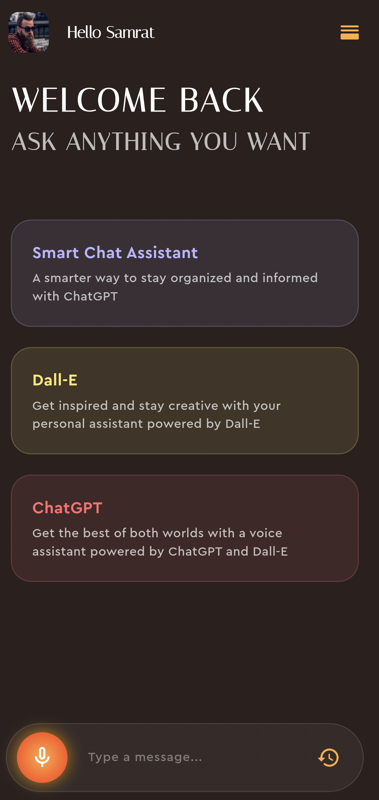
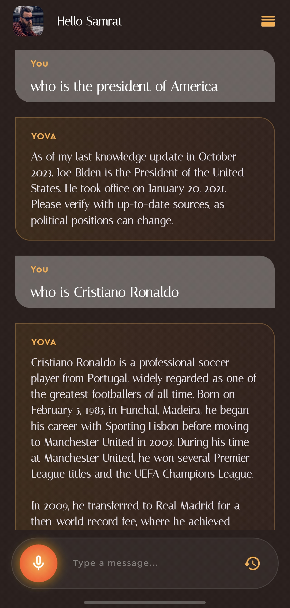
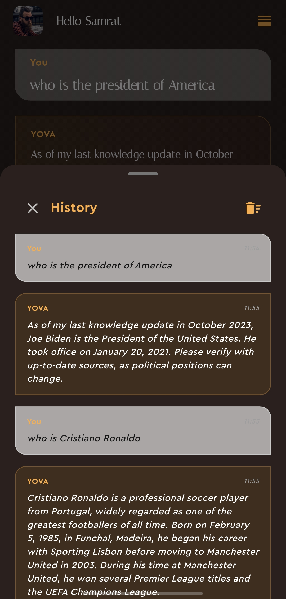

# 🎙️ Smart AI Voice Assistant

A modern AI-powered voice assistant built with **Flutter**. This application leverages **OpenAI's GPT-4o-mini** for intelligent conversations and **DALL-E 3** for stunning image generation, all wrapped in a sleek, glassmorphism-inspired UI.


---

## ✨ Features

-   **🗣️ Advanced Voice Interaction**: Fully integrated Speech-to-Text and Text-to-Speech for a hands-free experience.
-   **🤖 GPT-4o-mini Integration**: Smart, context-aware responses powered by the latest OpenAI models.
-   **🎨 DALL-E 3 Art Generation**: Generate high-quality images and art pieces simply by asking.
-   **💎 UI/UX**:
    -   **Glassmorphism Design**: Semi-transparent containers with subtle borders and blurs.
    -   **Animated Experience**: Typewriter effects, staggered entry animations, and glowing interactive buttons.
    -   **Dynamic AppBar**: A smart AppBar that hides on scroll to maximize screen real estate.
    -   **Bouncing Physics**: Professional, smooth scrolling feel throughout the app.
-   **📚 Conversation History**: Keep track of your past interactions with an elegant bottom-sheet history view.
-   **🛑 Stop Voice Control**: Instantly silence the assistant with a dedicated dynamic stop button.

---

## 🏗️ Project Structure

The project follows a clean, modular architecture for better maintainability:

```text
lib/
├── core/           # Color palettes, font styles, and secrets
├── models/         # Data models (Message, etc.)
├── pages/          # Main application screens (HomePage)
├── services/       # External API integrations (OpenAI Service)
└── widgets/        # Reusable UI components (ControlBar, ChatList, etc.)
```

---

## 🚀 Getting Started

### Prerequisites

-   Flutter SDK (Latest Version)
-   An OpenAI API Key

### Setup

1. **Clone the repository**:

    ```bash
    git clone https://github.com/your-username/voice-assistant-app.git
    ```

2. **Install dependencies**:

    ```bash
    flutter pub get
    ```

3. **Configure API Key**:
   Create a file at `lib/core/secrets.dart` and add your OpenAI API key:

    ```dart
    const openAIAPIKey = 'YOUR_OPENAI_API_KEY_HERE';
    ```

4. **Run the app**:
    ```bash
    flutter run
    ```

---

## 📦 Key Dependencies

-   `http`: For robust API communication.
-   `flutter_tts`: For high-quality text-to-speech output.
-   `speech_to_text`: For accurate real-time voice recognition.
-   `animate_do` & `animated_text_kit`: For premium UI animations and typewriter effects.
-   `avatar_glow`: For the signature pulsing microphone effect.

---

## 📸 Screen Highlights

<p align="center">
  
  
  
</p>

-   **Welcome Screen**: Features staggered animated info boxes about "Smart Chat", "Dall-E", and "ChatGPT".
-   **Chat Interface**: Clean, alternating message bubbles with support for AI-generated images.
-   **History View**: A transparent, sliding modal providing quick access to previous chats.

---

## 🤝 Contributing

Contributions, issues, and feature requests are welcome! Feel free to check the [issues page](https://github.com/your-username/voice-assistant-app/issues).
